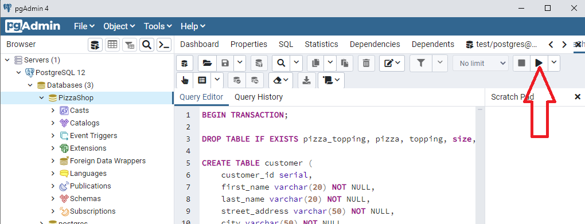
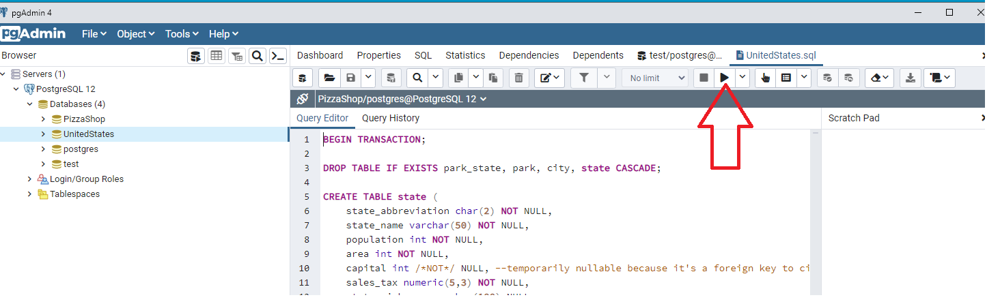
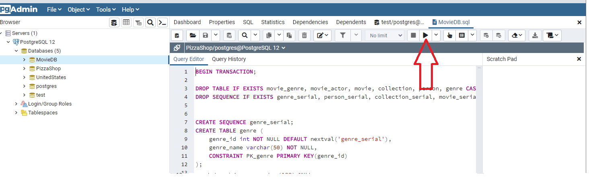

# Getting started

* Create a PostgreSQL database
* Execute a script to create schema(tables) and data

You'll write your statements in **pgAdmin**. pgAdmin connects to a PostgreSQL database server so you can run SQL statements and perform other database-related functions. Refer to the unit about PostgreSQL in the Intro to Tools section of this course for details on getting started with PostgreSQL and pgAdmin.

## PizzaShop

### Create the database

In pgAdmin, connect to PostgreSQL, and click on the **Databases** node to select it. Right click and select Create -> Database..
Enter the Database name *PizzaShop* in the field for Database and cick Save. 

### Populate the database with tables and data

In pgAdmin, connect to PostgreSQL and expand the **Databases** node by double-clicking it or clicking the caret on its side. Locate the **PizzaShop** database in the list, and click the caret on its side to expand it. This establishes the database for your statements to run on.

The PizzaShop.sql file contains the commands you need to execute. Open this files in pgAdmin by using the **Open File** button in the **Query Tool** window:

You can navigate to the file by double clicking the folders to the resources/postgresql folder, or enter C:\Users\Student\workspace\your-name-code\resources\postgresql\PizzaShop.sql directly. Click the Select button to open the file.

Run the statement by pressing the **F5** key on your keyboard, or click the "play" triangle button in the toolbar:

## UnitedStates

### Create the database

In pgAdmin, connect to PostgreSQL, and click on the **Databases** node to select it. Right click and select Create -> Database..
Enter the Database name *UnitedStates* in the field for Database and cick Save. 

### Populate the database with tables and data

In pgAdmin, connect to PostgreSQL and expand the **Databases** node by double-clicking it or clicking the caret on its side. Locate the **UnitedStates** database in the list, and click the caret on its side to expand it. This establishes the database for your statements to run on.

The UnitedStates.sql file contains the commands you need to execute. Open this files in pgAdmin by using the **Open File** button in the **Query Tool** window.

You can navigate to the file by double clicking the folders to the resources/postgresql folder, or enter C:\Users\Student\workspace\your-name-code\resources\postgresql\UnitedStates.sql directly. Click the Select button to open the file.

Run the statement by pressing the **F5** key on your keyboard, or click the "play" triangle button in the toolbar:

## MovieDB

### Create the database

In pgAdmin, connect to PostgreSQL, and click on the **Databases** node to select it. Right click and select Create -> Database..
Enter the Database name *MovieDB* in the field for Database and cick Save. 

In pgAdmin, connect to PostgreSQL and expand the **Databases** node by double-clicking it or clicking the caret on its side. Locate the **MovieDB** database in the list, and click the caret on its side to expand it. This establishes the database for your statements to run on.

The MovieDB.sql file contains the commands you need to execute. Open this files in pgAdmin by using the **Open File** button in the **Query Tool** window:

You can navigate to the file by double clicking the folders to the resources/postgresql folder, or enter C:\Users\Student\workspace\your-name-code\resources\postgresql\MovieDB.sql directly. Click the Select button to open the file.

Run the statement by pressing the **F5** key on your keyboard, or click the "play" triangle button in the toolbar:

